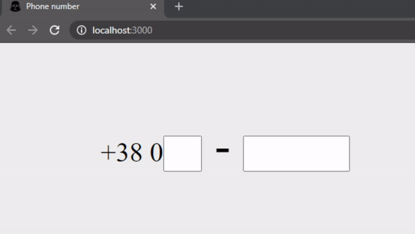

# React online marathon

## The tasks of the topic Ref:



### Modify the React component `Input`:

Change only `src/components/input/input.js`. Keep the existing HTML structure and do not remove the `data-testid` attributes. The tests use them to find the elements.

A functional component is allowed.

The component renders a Ukrainian mobile number in the form `+38 0XX XXXXXXX`:

- `data-testid="operator-name"` — the operator name. It is empty until the operator code is complete.
- the text `+38 0`
- `data-testid="operator-input"` — the operator code (2 digits)
- `data-testid="check-icon"` — the status mark. Its initial text is `-`
- `data-testid="phone-input"` — the phone number (7 digits)

### Requirements

- Only digits may be entered in either field. Ignore every other character. Use a regular expression for this. For example, `e67` in the operator field is treated as `67`, and `6udemy53487yyy7` in the phone field is treated as `6534877`.
- Listen to the `onInput` event on both inputs.
- When the page loads, focus the operator field. Use a `ref`. The tests check that `data-testid="operator-input"` has focus after render.
- When the operator field contains exactly 2 digits, show the matching operator name in `data-testid="operator-name"` and move focus to the phone field. Use a `ref` for the focus move. The tests check this after `67` and after `e67` (the letter is ignored, so two digits remain). Until the field contains 2 digits, focus stays on the operator field. Operator codes:

  - `Kyivstar`: 67, 68, 96, 97, 98
  - `Vodafone`: 50, 66, 95, 99
  - `Lifecell`: 63, 73, 93
  - `3mob`: 91
  - `People.net`: 92
  - `intertelecom`: 89, 94
  - `Unknown`: any other 2-digit code

  If the operator field contains fewer than 2 digits, leave the operator name empty.
- When the operator field contains exactly 2 digits and the phone field contains exactly 7 digits, replace `-` in `data-testid="check-icon"` with `✔️`. Otherwise leave the mark as `-`.

### Scripts

```bash
npm install
npm start
npm test
```

`npm start` runs the app at [http://localhost:3000](http://localhost:3000). `npm test` starts Jest in watch mode. The autograder runs the suite once with `CI=true npm test`.
